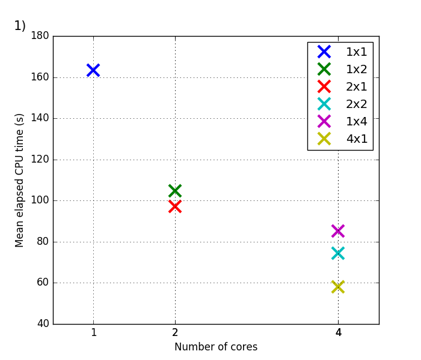

# awsroms

Test the ROMS ocean model on AWS

### Preliminary results

Figure 1: CPU time per compute node for the ROMS "small" benchmark test (benchmark1.in), as function of the number of cores. Computations are performed on t2.micro instances of AWS, which have one core ("vCPU") per node (as of 2016/11/01). Each data point shows the average time of all nodes, measured from one single experiment. The inset shows the domain partition (tiling) of the 512x64 point domain. The result indicates that "square-like" partitions yield better performance, and slightly nonlinear scaling.

### Why AWS?

We assume that AWS has currently the biggest market share of the mainstream public cloud providers, and therefore can be assumed to have relatively recent, representative technology. Focusing on a single provider allows us to use ”proprietary” (in the sense of ”non-portable”) helper tools to simplify the provisioning process (in the case of AWS that would be cloudfront etc. in general, and cfncluster in particular). Although this necessarily leads to non-portable code, it provides a proof of concept and yields a concrete hardware/networking topology pattern, which can later be adapted to other cloud providers.

The long-term goal is to produce configuration tools which are portable between cloud providers, to avoid ”provider lock-in”. Clearly, it is desirable to have configuration software that works in combination with most public cloud providers and popular open-source software platforms for private clouds (OpenStack, etc.)

### Issues, Questions

* cfncluster seems to be using Chef, which is written in Ruby/Erlang. Scientists are probably more familiar with Python than Ruby/Erlang. Can we use Ansible instead, which is written in Python? This would increase transparency, accessablility, etc.
